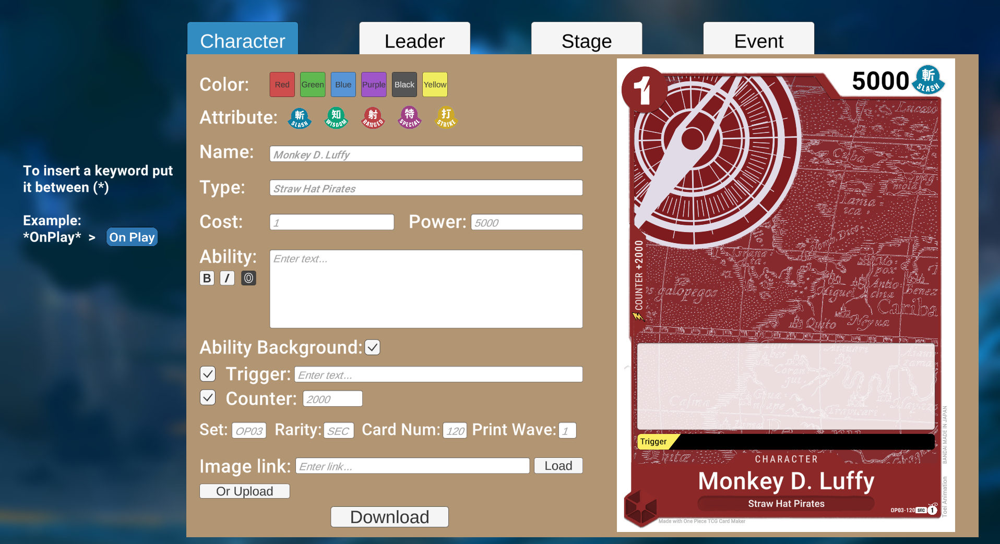
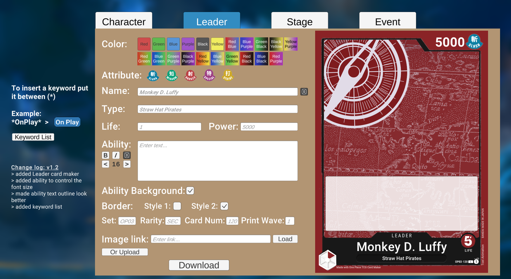
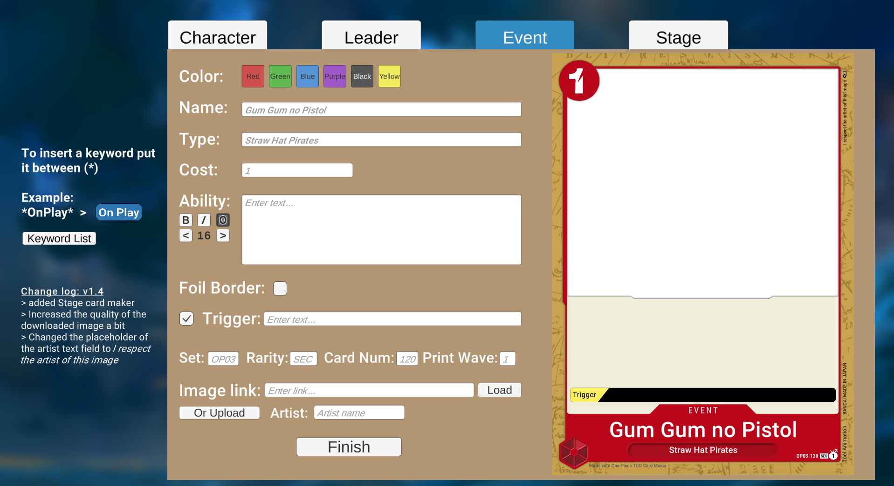
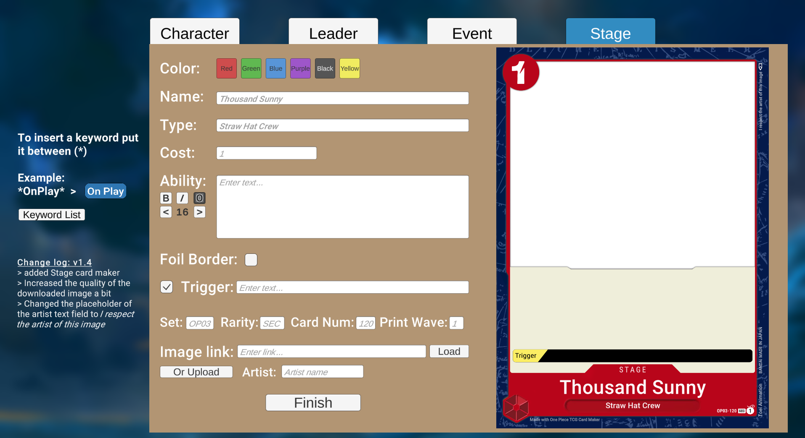
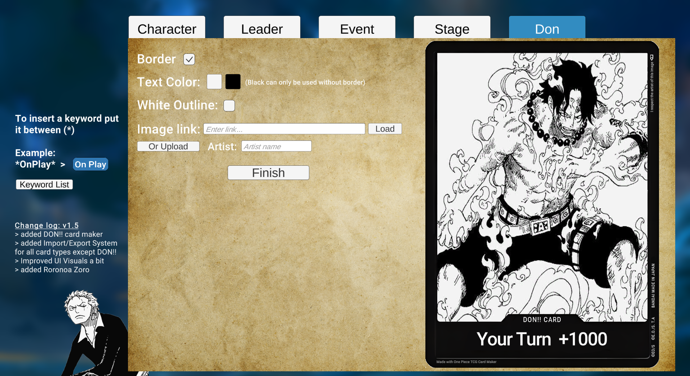
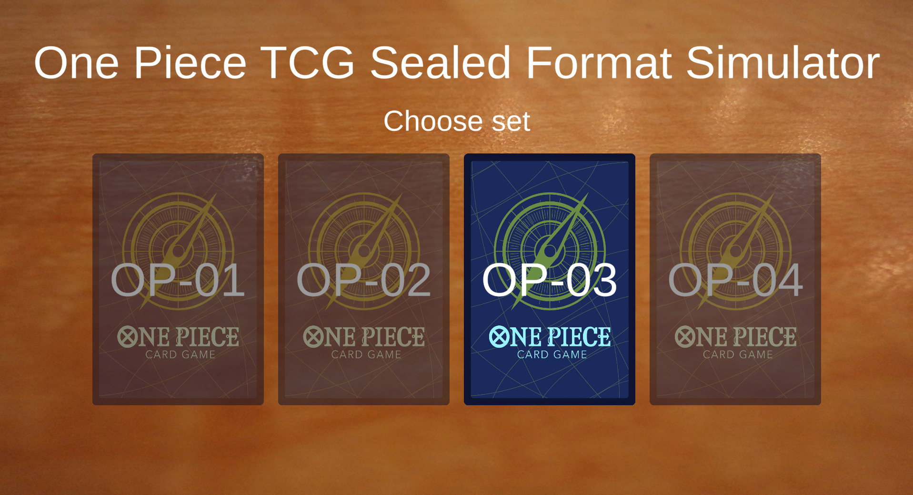
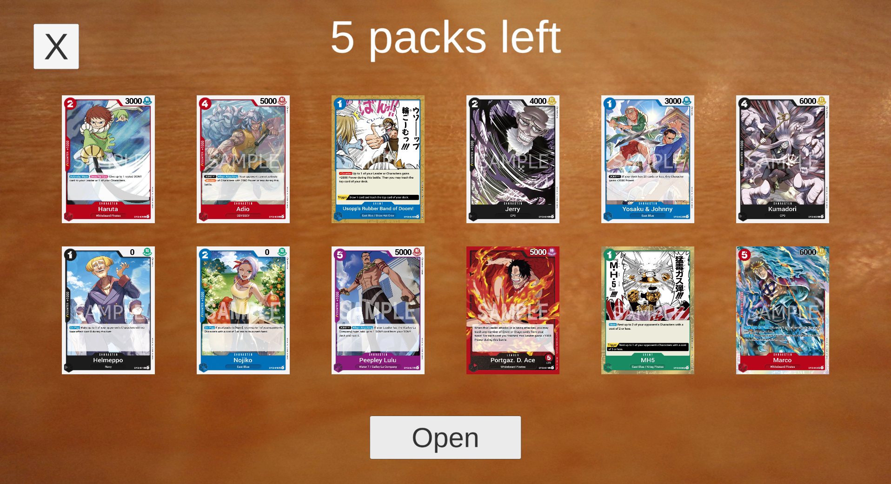
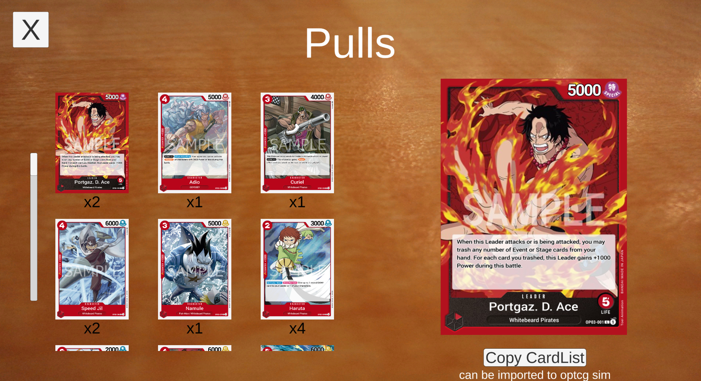

# One-Piece-TCG-Utilities
A repository of useful programs for the one piece trading card game

Table of Contents
-----
* [Card Maker](#cardMaker)
* [Sealed Format Simulator](#sealed)

### <a name="cardMaker"> Card Maker </a>
Create Custom Character, Leader, Event, Stage and Don Cards!

**ChangeLog v1.6:**

1.  Added Border Styles for leader cards (OP1/2, OP3, Rainbow)
2. Added Border Eraser (Feature still in development, please report any bugs)
* Known Bug: Cannot interact in finished page if Border Eraser is enabled.

Credits to **Roko** from the **One Piece Trading Card Game Community** discord server for making most of the templates used in the card maker.
Link: https://discord.gg/W8afM9D5s2

### <a name="sealed"> Sealed Format Simulator </a>

Sealed is the format used in pre-releases. You get 6 booster packs and have to create a 40 card deck with the cards you get. In the simulator you can open the packs and then copy the card list to optcg simulator by Batsu to create your deck.

**ChangeLog v1.2:**
1. Added OP03 set

